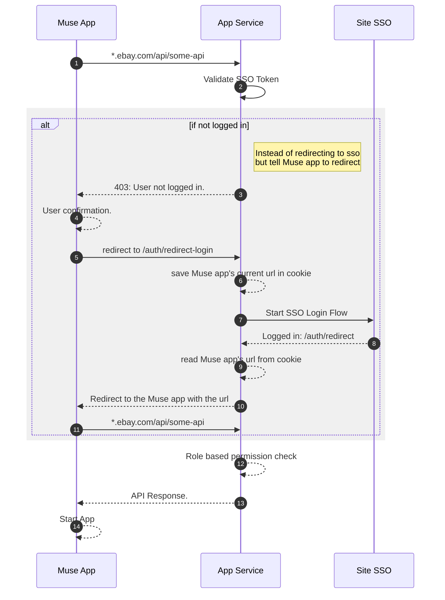

# Site SSO Integration
A Muse app is a single page application which uses XMLHttpRequest to interact with a backend service. So the backend API shouldn't redirect to a page needs user's interaction like SSO. Instead, the backend API needs to tell the Muse app to redirect while not logged in. This is the main difference compared to a server side rendering web application.

See below diagram for the flow:

## Implementation
- The backend needs to allow cross origin request from the domain of the Mues app (e.g: myapp.muse.vip.ebay.com). And it should allow the `localhost` for local development.
:::danger
 Don't use a wildcard *. But set specific domains.
:::
- To allow cookies to be sent from Muse app to backend, need to use [`withCredentials: true`](https://developer.mozilla.org/en-US/docs/Web/API/XMLHttpRequest/withCredentials) for XML http requests.
- The backend header should have: `Access-Control-Allow-Credentials=true`.
- The backend needs to intecept all API requests and respond 403 instead of redirecting to login if token is invalid.
- The backend needs to implement below APIs:
    - **/auth/redirect-to-login**: start site sso flow.
    - **/auth/redirect-after-login**: callback URI after sso login sccuess. It redirects to the correct Muse app Url and path.

